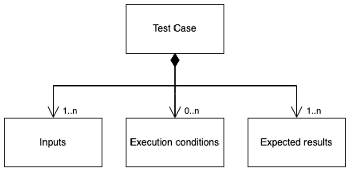
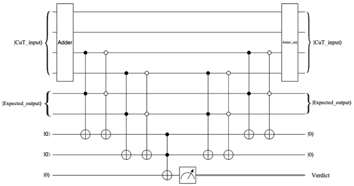

# Automatic generation of testing circuits for deterministic quantum algorithms
Quantum computing will enable an exponential acceleration in the performance of a broad set of computational problems such as cryptography, machine learning, or chemical simulation. However, the quantum potential is not only a matter of hardware but also software and therefore this disrupting paradigm has an impact yet to explore in the software development process and techniques. Adapting classical software engineering to the new classical/quantum hybrid systems raises many challenges that demand a new Quantum Software Engineering. Fo- cusing on quality, quantum software verification is still an open research issue since quantum properties such as entanglement or superposition require new techniques as well as adaptations of classical ones to be addressed. Most of the current approaches for test-based verification relies heavily on simulations which is an issue due to the lack of scalability of simulators executed on classical computers. To address this gap, we define the concept of ”Quantum Test Case” and then present a method for testing quantum circuits in real machines without the use of simulation testing features such as amplitude calculation or non-destructive measure. This is achieved by automatically generating a Quantum Test Case Circuit which wraps the circuit under test and performs the verification. We also present the process to execute a test suite over a circuit with this method along with an example to illustrate the technique. For the sake of replicability, an implementation is available through a repository.

**Figure 1:** Quantum Test Case Parts

**Figure2:** Example of Quantum Test Circuit
